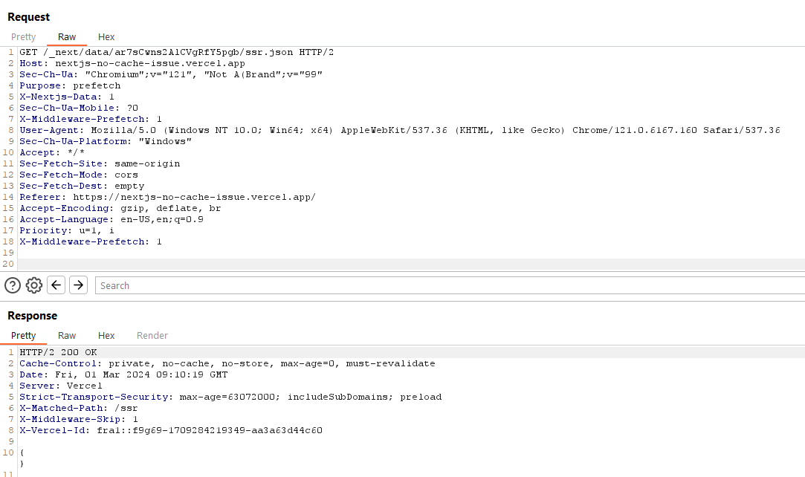

Example project for demonstrating prefetch of data for SSR pages returning empty object without a cache-control header
having no-cache directive. This can potentially cause issues with CDNs as it did in our case. For example CloudFront
having a default TTL value of higher than 0, which by default is 24h, would result in the CDN caching the empty
response.
The empty cached response would then be served by the CDN when user navigates to the SSR page and the page tries to
fetch
server side props using the same URL (.../ssr.json)

The enabler for this behaviour seems to be using a middleware. If a middleware (middleware.ts) is present then the
prefetch for pages is done separately for each page whose path is present on the page via Link component (prefetch
true).

## How the problem manifests

Run the server in production mode

```
yarn
yarn build
yarn start
```

and navigate to http://localhost:3000/. Observer the network for example with chrome developer tools. When loading the
static home page the app also prefetches the ssr pages json. What the response for the SSR page json is missing is
cache-control no-cache directive. Navigating to the ssr page results in the ssr pages json being re-fetched and this
time
it does include the no-cache directive but if there would be a caching element in between like a CDN then we would not
hit
the actual api until the empty cached response expires.

## How to hide the problem

If you remove the middleware.js file or configure the next.config.js to return cache-control: no-cache for SSR paths
you can circumvent the issue.

## Expectations

I'd expect next.js to behave sensibly in terms of cache control and set no-cache directive for getServerSideProps as
stated in next.js documentation

```
If the page uses getServerSideProps or getInitialProps, it will use the default Cache-Control header set by next start
in order to prevent accidental caching of responses that cannot be cached. If you want a different cache behavior while 
using getServerSideProps, use res.setHeader('Cache-Control', 'value_you_prefer') inside of the function as shown above.
```

### The CVE-2023–46298 isn't reproducible, as it is showed below

